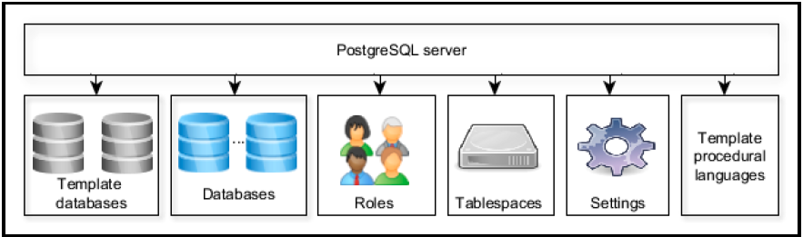
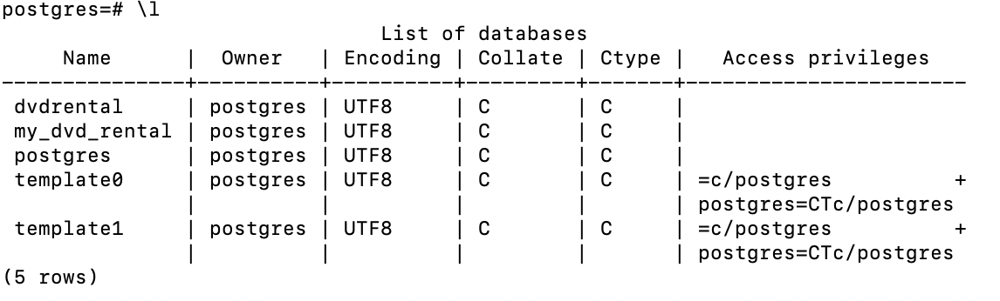
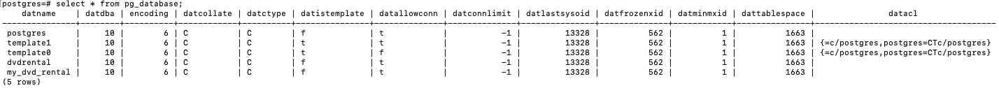

1. Database coding

1.1. Database naming conventions

Chỉ là sở thích trong series này
- Tên của table, view không dùng suffix
- Tên là unique trong database hay trong schemas
- Không viết tắt
- Không ở dạng số nhiều
- Dùng _ để phân tách các từ trong tên có nhiều từ
- Khoá chính <tên table>_ID
- Khoá ngoại cùng tên với tên khoá chính ở bảng tham chiếu

1.2. PostgreSQL identifiers  
Theo ANSI SQL, không quan tâm in hoa - thường. Tuân theo các ràng buộc sau:  
- Bắt đầu với _ hay ký tự
- Có thể dùng ký tự, ký số, _, và $
- Độ dài trong khoảng 1-63

1.3. Document  
Dùng ```--``` hay ```/* */```. PostgreSQL cho phép lưu database object description thông qua ```COMMENT ON```.

1.4. Version control system  
Nên có một installation script và thực thi nó trong một transaction.  
Tạo rollback script để nhanh chóng quay về schema kề trước ở application level.  

Thường duy trì DDL script, DML script, và DCL script riêng lẻ. Lưu DDL script cho các thành phần không thuộc physical schema như view, function ở file riêng.

1.5. Database-migration tools  
Có vài tools: Liquibase, Sqitch, <b>Flyway</b>.

2. PostgreSQL object hierarchy  


2.1. Template databases  
Mặc định một database khi được tạo ra, nó là clone của ```template1``` database.  
Template này chứa tập các table, view, và function dùng để model mối quan hệ giữa các user-defined database object. Những table, view, và function này là một phần của system catalog schema ```pg_catalog```.  
Ngoài ```template1```, hệ thống còn có ```template0```. Đây là bản dự phòng của ```template1```, và nó không có chứa thông tin encoding-specific và locale-specific.  

Mình có thể tạo mới database bỡi dùng một database nào có sẵn.

2.1. User database  
Một client kết nối tới PostgreSQL chỉ có thể truy cập tới data trong một database (Cái được chỉ định trong connection string). Có thể vượt qua cái này bỡi dùng <b>PostgreSQL foreign data wrapper</b> hay DB link extensions.

Mỗi database có một owner và một tập các permissions liên quan để quản lý các actions cho một role cụ thể. Các quyền trên PostgreSQL object, bao gồm databases, views, tables, và sequences, được thể hiện trong ```qsql``` client qua lệnh: ```<user>=<privileges>/granted by``` Nếu phần user của privileges không thấy, có nghĩa rằng những privilege này được apply tới ```PUBLIC``` role.



Database-access privileges:
- CREATE (-C): quyền create access cho phép role cụ thể tạo mới schemas trong database.
- CONNECT (-c): Khi một role cố gắng connect tới một database, các quyền connect được kiểm tra.
- TEMPORARY (-T): quyền temporary access cho phép role cụ thể tạo các table tạm. (Table tạm giống table bình thường, nhưng ko có lưu vật lý và sẽ bị huỷ sau khi kết thúc user session.)

Ngoài các thuộc tính trên hình, PostgreSQL còn có các thuộc tính khác:
- maintenance: thuộc tính ```datfrozenxid``` được dùng bỡi các thao tác autovaccum.
- storage management: thuộc tính ```dattablespace ``` được dùng để chỉ định tablespace nào chứa database.
- concurrency: thuộc tính ```datconnlimit``` được dùng để chỉ định số lượng kết nối đồng thời (-1 không hạn chế)
- protection: thuộc tính ```datallowconn``` chặn kết nối tới database. Được dùng chính để ngăn thay đổi trên ```template0```

```\c``` tạo một kết nối mới tới database và đóng kết nối hiện tại.  
Các table ```pg_catalog``` chứa các thông tin của database.


Page 81