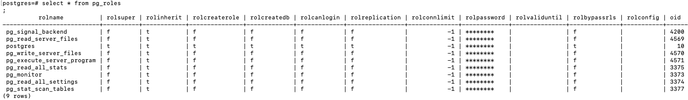
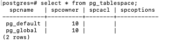
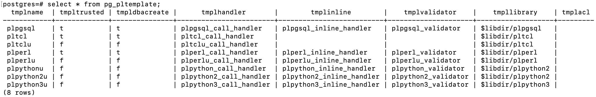
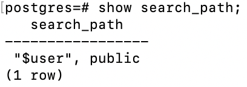

## Database coding

### Database naming conventions

Chỉ là sở thích trong series này
- Tên của table, view không dùng suffix
- Tên là unique trong database hay trong schemas
- Không viết tắt
- Không ở dạng số nhiều
- Dùng _ để phân tách các từ trong tên có nhiều từ
- Khoá chính <tên table>_ID
- Khoá ngoại cùng tên với tên khoá chính ở bảng tham chiếu

### PostgreSQL identifiers  
Theo ANSI SQL, không quan tâm in hoa - thường. Tuân theo các ràng buộc sau:  
- Bắt đầu với _ hay ký tự
- Có thể dùng ký tự, ký số, _, và $
- Độ dài trong khoảng 1-63

### Document  
Dùng `--` hay `/* */`. PostgreSQL cho phép lưu database object description thông qua `COMMENT ON`.

### Version control system  
Nên có một installation script và thực thi nó trong một transaction.  
Tạo rollback script để nhanh chóng quay về schema kề trước ở application level.  

Thường duy trì DDL script, DML script, và DCL script riêng lẻ. Lưu DDL script cho các thành phần không thuộc physical schema như view, function ở file riêng.

### Database-migration tools  
Có vài tools: Liquibase, Sqitch, <b>Flyway</b>.

## PostgreSQL object hierarchy  


### Template databases  
Mặc định một database khi được tạo ra, nó là clone của ```template1``` database.  
Template này chứa tập các table, view, và function dùng để model mối quan hệ giữa các user-defined database object. Những table, view, và function này là một phần của system catalog schema ```pg_catalog```.  
Ngoài ```template1```, hệ thống còn có ```template0```. Đây là bản dự phòng của ```template1```, và nó không có chứa thông tin encoding-specific và locale-specific.  

Mình có thể tạo mới database bỡi dùng một database nào có sẵn.

### User database  
Một client kết nối tới PostgreSQL chỉ có thể truy cập tới data trong một database (Cái được chỉ định trong connection string). Có thể vượt qua cái này bỡi dùng <b>PostgreSQL foreign data wrapper</b> hay DB link extensions.

Mỗi database có một owner và một tập các permissions liên quan để quản lý các actions cho một role cụ thể. Các quyền trên PostgreSQL object, bao gồm databases, views, tables, và sequences, được thể hiện trong ```qsql``` client qua lệnh: ```<user>=<privileges>/granted by``` Nếu phần user của privileges không thấy, có nghĩa rằng những privilege này được apply tới ```PUBLIC``` role.


Database-access privileges:
- CREATE (-C): quyền create access cho phép role cụ thể tạo mới schemas trong database.
- CONNECT (-c): Khi một role cố gắng connect tới một database, các quyền connect được kiểm tra.
- TEMPORARY (-T): quyền temporary access cho phép role cụ thể tạo các table tạm. (Table tạm giống table bình thường, nhưng ko có lưu vật lý và sẽ bị huỷ sau khi kết thúc user session.)

Ngoài các thuộc tính trên hình, PostgreSQL còn có các thuộc tính khác:
- maintenance: thuộc tính ```datfrozenxid``` được dùng bỡi các thao tác autovaccum.
- storage management: thuộc tính ```dattablespace ``` được dùng để chỉ định tablespace nào chứa database.
- concurrency: thuộc tính ```datconnlimit``` được dùng để chỉ định số lượng kết nối đồng thời (-1 không hạn chế)
- protection: thuộc tính ```datallowconn``` chặn kết nối tới database. Được dùng chính để ngăn thay đổi trên ```template0```

```\c``` tạo một kết nối mới tới database và đóng kết nối hiện tại.  
Các table ```pg_catalog``` chứa các thông tin của database.


### Roles  
Roles thuộc PostgreSQL server cluster và không thuộc một database cụ thể nào. Một role có thể là một database user hay một database group.

Role có các thuộc tính:
- ```SUPERUSER```: một super role có đầy đủ quyền, ngoại trừ ```LOGIN```
- ```LOGIN```: Một role với thuộc tính ```LOGIN``` có thể được dùng bỡi một client để kết nối tới một database.
- ```CREATEDB```: một role có thuộc tính ```create database``` có thể tạo các database.
- ```CREATEROLE```: một role với thuộc tính này có thể tạo, xoá, và chỉnh sữa các role.
- ```REPLICATION```: role có thuộc tính này có thể được dùng để stream replication.
- ```PASSWORD```: role có thuộc tính ```PASSWORD``` có thể được dùng với phương thức xác thực ```md5``` và ```scram-sha-256```.
- ```CONNECTION LIMIT```: chỉ định số kết nối đồng thời mà người dùng có thể tạo.
- ```INHERIT```: Nếu chỉ định, role sẽ kế thừa các quyền đã gắn với các role mà nó là một thành viên. Nếu không chỉ định, ```INHERIT``` là mặc định.
- ```BYPASSRLS```: Nếu chỉ định, role này có thể vượt qua <b>row-level security (RLS)</b>

Note: khi cài đặt PostgreSQL, postgres superuser role được tạo.  
```CREATE USER``` tương đương với ```CREATEROLE``` + ```LOGIN``` option  
```CREATE GROUP``` tương đương với ```CREATEROLE``` + ```NOLOGIN``` option.  
Một role có thể là một thành viên của một role khác. ```GRANT```, ```REVOKE```.



### Tablespaces  
Một <b>tablespace</b> là một defined storage location cho một database hay các database object. ```CREATE TABLESPACE```


### Template procedural languages  
Được dùng để đăng ký một ngôn ngữ mới. Có hai cách để tạo một ngôn ngữ lập trình mới.
- bỡi chỉ định tên của ngôn ngữ. PostgreSQL sử dụng programming language template và xác định các tham số.
- chỉ định tên của ngôn ngữ cũng như các tham số.
```CREATE LANGUAGE```, ```CREATE EXTENSION```



### Settings  
Cấu hình: replication, write-ahead logs, resource comsumption, query planning, logging, authentication, statistic collection, garbage collection, client connections, lock management, error handling, và debug options.
```select * from pg_settings```

Các giá trị của ```context``` column:
- internal: Chỉ có thể thay đổi qua việc thay đổi source code, compile, và dựng lại database cluster.
- postmaster: khởi động lại server để sử dụng giá trị mới. Thường những thiết lập này được lưu trong ```postgresql.conf``` file.
- sighup: có thể thay đổi trong ```postgresql.conf``` file và chạy ```SIGHUP``` trên PostgreSQL server process.
- backend: có thể thiết lập cho một session cụ thể.
- superuser: chỉ superuser có thể thay đổi, có thể thay đổi trong ```postgresql.conf``` file hay qua lệnh ```SET```
- user: giống superuser, dùng để thay đổi các giá trị trong session-local.

Những thiết lập trong ```postgresql.conf.auto``` file sẽ override những thiết lập trong ```postgresql.conf``` file

```SET```, ```SHOW```
```pg_reload_conf()``` tương đương với ```SIGHUP```. Ưu tiên dùng ```pg_reload_conf()``` hay thông qua init script vì nó an toàn hơn ```SIGNUP```.  
```$qsql -U postgres -c "SELECT pg_reload_conf()"```


## PostgreSQL database components  
Một PostgreSQL database được xem như là một container cho các database schema (database chứa ít nhất một schema). Mặc định có ```public``` schema trong các template database.

### Schemas
Dùng để cô lập các object name. Schema chứa tất cả các database-named object: tables, views, functions, aggregates, indexes, sequences, triggers, data types, domains, và ranges.

Note: trong môi trường nhiều user, nhiều database, nên huỷ khả năng tạo object trong public schema: ```REVOKE CREATE ON SCHEMA public FROM PUBLIC;```

```search_path``` là tổng hợp các schema để server dùng khi tìm object. Khi tìm object, server tìm theo qualified database-object name.


#### Schema usages  
Schema được dùng bỡi vì các lý do sau:
- Control authorization: dùng các schema để gom nhóm các object giựa trên các role.
- Organize database objects: Có thể tổ chức các database object trong các nhóm giựa trên business logic. Ví dụ, dữ liệu historical và auditing có thể được gom và tổ chức trong một schema riêng.
- Maintain third-party SQL code: các extension trong các package có thể được dùng trong nhiều ứng dụng. Quản lý các extension này trong các schema riêng lẻ giúp dùng lại extension và update chúng dễ dàng.

Ví dụ tạo schema sales, owned bỡi sale role:
```CREATE SCHEMA sales AUTHORIZATION sale;```

### Tables
``` CREATE TABLE``` dùng để tạo table, clone table (hữu ích để tạo rollback script), materialize kết quả của ```SELECT``` (để boost hiệu năng).
Các kiểu table:
- Ordinary table: sống với database.
- Temporary table: sống với user session
- Unlogged table: nhanh hơn ordinary table (vì data không được viết vào các WAL file) -> không crash-safe, không thể replicated tới standby node (vì streaming replication hoạt động giựa trên việc chuyển các WAL file).
- Child table: là một ordinary table và kế thừa từ một hay nhiều table. Kế thừa thường được dùng với ràng buộc exclusion để phân vùng vật lý cho data và cải thiện hiệu năng bỡi lấy một tập nhỏ data hơn là nguyên con.

Ref: https://www.postgresql.org/docs/current/sql-createtable.html

## PostgreSQL native data types
Khi chọn một data type, cần chú ý các yếu tố:
- Extensibility: thay đổi maximum length của type có gây ra viết lại toàn bộ table hay scan toàn bộ table ko?
- Data type size: lạm dụng big size -> tốn tài nguyên
- Support: type có được driver đang dùng hỗ trợ hay không? Nếu không thì đổi driver hay viết serialize và deserialize data.

### Numeric types

| Name | Comments | Size | Range |
| --- | --- | --- | --- |
| smallint | SQL equivalent: Int2 | 2 bytes | -32,768 to +32,767. |
| integer | SQL equivalent: Int4  Integer is an alias for INT. | 4 bytes | -2,147,483,648 to +2,147,483,647. |
| bigint | SQL equivalent: Int8 8 bytes | 8 bytes | -9,223,372,036,854,775,808 to +9,223,372,036,854,775,807. |
| numeric or decimal | No difference in PostgreSQL | Variable | Up to 131,072 digits before the decimal point; up to 16,383 digits after the decimal point. |
| real | Special values: Infinity, Infinity, NaN | 4 bytes | Platform-dependent, at least six-digit precision. Often, the range is 1E-37 to 1E+37. |
| double precision | Special values: Infinity, Infinity, NaN | 8 bytes | Platform dependent, at least 15-digit precision. Often, the range is 1E-307 to 1E+308. |

Precision là tổng số ký số, scale là số ký số phần thập phân.
Numeric và decimal nên dùng cho tiền tệ và những giá trị yêu cầu precision.  
Những giá trị không yêu cầu precision thì nên dùng float, double. (tối ưu tốc độ xử lý)  
Floating-point và double precision không chính xác; giá trị trong một số trường hợp không thể được thể hiện dạng binary format và lưu trữ dạng gần đúng.  
Các kiểu ```smallserial, serial, và bigserial``` là đóng gói của ```smallint, integer, và bigint```. ```serial``` không thực sự là data type. Chúng thường được dùng như các surrogate key và không có ```null``` value (mặc định). ```serial``` sử dụng sequence ở phía dưới. Một sequence là một database object được dùng để tạo sequence bỡi chỉ định min, max, step.

ví dụ:

```sql
CREATE TABLE customer (
  customer_id SERIAL
)
```
Tương đương với
```sql
CREATE SEQUENCE customer_customer_id_seq;
CREATE TABLE customer (
  customer_id integer NOT NULL DEFAULT nextval('customer_customer_id_seq')
);
ALTER SEQUENCE customer_customer_id_seq OWNED BY customer.Customer_id;
```

Chú ý khi tạo column với serial type:
- Một sequence sẽ được tạo với tên tableName_columnName_seq
- Column sẽ có ```NOT NULL``` constraint
- Column sẽ có một default value được tạo bỡi ```nextval()``` function.
- Sequence sẽ được owne bỡi column (-> sequence bị xoá khi column bị xoá)

#### Serial types and identity columns  
Các cột serial và idenity được dùng để định nghĩa các key thay thế.
```GENERATED { ALWAYS | BY DEFAULT } AS IDENTITY [ ( sequence_options ) ]```
Identity column vẫn ưu tiên hơn serial, vì serial type có các hạn chế:
- Compatibility: idenitity column là SQL chuẩn -> dễ migrate PostgreSQL sang các database quan hệ khác
- Permission: các quyền của sequence object được tạo bỡi dùng serial column được quản lý riêng lẻ -> thường quên quản lý quyền cho sequence object
- Sequence value and user data precedence: mặc định serial type dùng constraint để gán dữ liệu cho column. Bạn có thể override giá trị mặc định. Identity column cũng thế. ```BY DEFAULT``` cho phép người dùng insert data vào column. ```ALWAY``` - giá trị của người dùng sẽ không được chấp nhận trừ khi trong câu ```INSERT``` có thêm tuỳ chọn ```OVERRIDING SYSTEM VALUE```. ```COPY``` không quan tâm option này.
- Managing table structure: quản lý identity column sẽ dễ dàng hơn.

Cả indentity column và serial type đều dùng các sequence object ở bên dưới.

### Character types

| Name | Comments | Trailing spaces | Maximum length |
| --- | --- | --- | --- |
| char | Equivalent to char(1), it must be quoted as shown in the name. | Semantically insignificant | 1 |
| name | Equivalent to varchar(64). Used by Postgres for object names. | Semantically significant | 64 |
| char(n) | Alias: character(n). Fixed-length character where the length is n. Internally called blank padded character (bpchar). | Semantically insignificant | 1 to 10485760 |
| varchar(n) | Alias: character varying(n). Variablelength character where the maximum length is n. | Semantically significant | 1 to 10485760 |
| text | Variable-length character. | Semantically significant | Unlimited |

Với ```char, varchar```, nếu value dài hơn kích thước tối đa thì khi ```INSERT, UPDATE``` sẽ báo lỗi, trừ khi phần dư là khoản trắng. Trong trường hợp thừa data khi ép kiểu thì dữ liệu thừa sẽ bị cắt bỏ và không báo lỗi.

Kích cỡ lưu trữ text tuỳ thuộc vài yếu tố: độ dài của chuỗi, text decoding, và compression.  
```text``` có thể được xem như unlimited ```varchar()``` type.
Trong PostgreSQL, không có khác biệt về hiệu năng giữa các kiểu character => <b>Nên dùng ```text```</b>

```sql
CREATE TABLE emulate_varchar(
  test VARCHAR(4)
);
--semantically equivalent to
CREATE TABLE emulate_varchar (
  test TEXT,
  CONSTRAINT test_length CHECK (length(test) <= 4)
);
```

### Date and time types  

| Name | Size in bytes | Description | Low value | High value |
| --- | --- | --- | --- | --- |
| Timestamp without time zone | 8 | Date and time without time zone, equivalent to timestamp | 4713 BC | 294276 AD |
| Timestamp with time zone | 8 | Date and time with time zone, equivalent to timestamptz | 4713 BC | 294276 AD |
| Date | 4 | Date only | 4713 BC | 294276 AD |
| Time without time zone | 8 | Time of day | 00:00:00 | 24:00:00 |
| Time with time zone | 12 | Time of day with time zone | 00:00:00+1459 | 24:00:00-1459 |
| Interval | 16 | Time interval | -178,000,000 years | +178,000,000 years |

PostgreSQL lưu timestamp trong định dạng UTC. Có hai tiếp cận khi dùng timestamp. 
- Dùng timestamp không có timezone và client quản lý việc sai khác timezone. Cách này phù hợp với các ứng dụng phát triển in-house, ứng dụng chỉ có 1 timezone, và khi client biết được các khác biệt timezone.
- Dùng timestamp với timezone, trong PostgreSQL có ```timestamptz``` extension.
  - Đảm bảo thiết lập default timezone cho tất cả các connection. Thực hiện trong ```postgresql.conf``` file. Nên để chọn UTC, UTC cũng giúp chúng ta trên vấn đề DST (daylight savings time).
  - Timezone nên được chỉ định trong mỗi CRUD.
  - Không thực hiện các thao tác trên timestamp không có timezone và timestamp có timezone.
  - Dùng database server để chuyển đổi các khác biệt timezone.

```DAYSTYLE``` setting có 2 mục đích:
- Setting the display format: ```DAYSTYLE``` chỉ định timestamp và ```timestamptz``` rendering style
- Interpreting ambiguous data: ```DAYSTYLE``` chỉ hình interpret timestamp và ```timestamptz``` như thế nào.

Các view ```pg_timezone_names, pg_timezone_abbrevs``` cung cấp danh sách các tên và tên viết tắt của các timezone.
```AT TIME ZONE``` convert timestamp đến một timezone cụ thể.

```now()``` trả về current timestamp với current timezone.

Convert timestamp tới timezone cụ thể:
- ```'y'::TIMESTAMP WITHOUT TIMEZONE AT TIME ZONE 'x'```
- ```'y'::TIMESTAMP WITH TIMEZONE AT TIME ZONE 'x'```

Dùng ```date``` khi không quan tâm time.
```interval``` dùng để quản lý các thao tác trên timestamp - được xem như là một quảng thời gian.

## Ref
- Salahaldin Juba_ Andrey Volkov - Learning PostgreSQL 11_ A beginner’s guide to building high-performance PostgreSQL database solutions, 3rd Edition (2019, Packt Publishing)