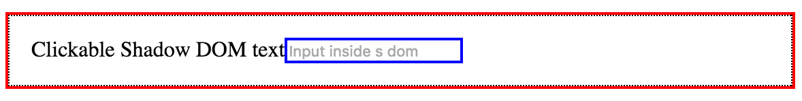
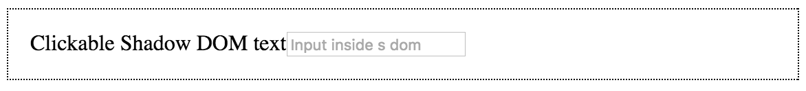
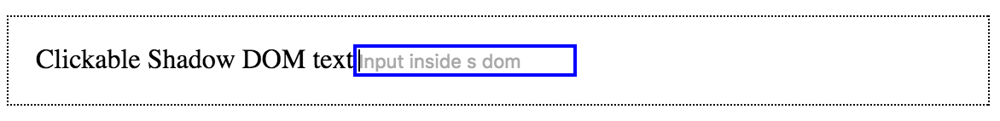
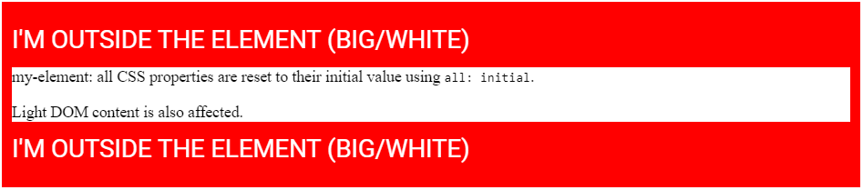

## What is shadow DOM?
Shadow DOM loại bỏ tính dễ vỡ của xây dựng ứng dụng web. Dễ vỡ từ tính tự nhiên của HTML, CSS, và JS. Ví dụ, khi tạo mới một HTML id/class, không ai cho bạn biết có conflict nào không. Rồi ```!important``` trong CSS.

Shadow DOM fixes CSS and DOM. Shadow DOM giới thiệu scoped style. Bạn có thể đóng gói CSS với markup, ẩn chi tiết, và author self-contained components trong JS.

Shadow DOM là một trong bốn chuẩn Web Component: HTML template, Shadow DOM, [Custom element](https://thunguyen1012.github.io/posts/web_components_customelements.html), và HTML import.

Shadow DOM được thiết kế như là một tool để xây dựng component-based app. Vì thế, nó cung cấp giải pháp cho các vấn đề phổ biến trong lập trình web:
- Isolated DOM: DOM của component là tự quản lý (ví dụ: ```document.querySelector()``` sẽ không trả về các node trong shadow DOM của component.)
- Scoped CSS: CSS định nghĩa trong shadow DOM được scope trong đó. Nội bất xuất, ngoại bất nhập.
- Composition: declarative, markup-based API
- Simplifies CSS: Scoped DOM cho phép bạn tạo các CSS selector đơn giản. Ít lo lắng về conflict.
- Productivity: App sẽ là tổng hợp các DOM thay vì một DOM siêu bự.

## Create shadow DOM
HTML dễ cho người đọc hiểu, nhưng khó cho máy - DOM xuất hiện. Khi trình duyệt tải một trang web, có nhiều việc diễn ra. Một trong số đó là chuyển HTML thành một live document. Cơ bản, để hiểu cấu trúc của trang, trình duyệt parse HTML thành một data model. Trình duyệt thể hiện cấu trúc của HTML bỡi tạo một cấu trúc cây: DOM. DOM có các thuộc tính, phương thức, và có thể được xử lý bỡi lập trình.

```javascript
const header = document.createElement('header');
const h1 = document.createElement('h1');
h1.textContent = 'Hello DOM';
header.appendChild(h1);
document.body.appendChild(header);
```

Tạo HTML
```html
<body>
  <header>
    <h1>Hello DOM</h1>
  </header>
</body>
```

DOM...in the shadows
Shadow DOM là DOM với 2 điểm khác: 1) Cách nó được tạo và sử dụng. 2) Mối tương quan của nó với phần còn lại của trang.
Cơ bản, bạn tạo các DOM node và append chúng như là con của element khác. Với shadow DOM, bạn tạo một scoped DOM tree và gắn nó với một element, nhưng phân tách với các của thực sự của element. Tree này được gọi là **shadow tree**. Element được gắn shadow tree vào gọi là **shadow host**. Mọi thứ bạn thêm trong shadow trở nên cục bộ trong hosting element, kể cả ```<style>```.

## Create shadow DOM
Để tạo shadow DOM cho một element, gọi ```element.attachShadow()```:

```javascript
const header = document.createElement('header');
const shadowRoot = header.attachShadow({mode: 'open'});
shadowRoot.innerHTML = '<h1>Hello Shadow DOM</h1>'; // Could also use appendChild().

// header.shadowRoot === shadowRoot
// shadowRoot.host === header
```
Ở đây dùng ```innerHTML``` để fill shadow root, bạn có thể tùy ý.

Có vài element không thể là host của shadow tree:
- browser đã host internal shadow DOM của nó cho element (```<textarea>, <input>```)
- Không có lý do để element host một shadow DOM (``````)

Ví dụ:
```javascript
document.createElement('input').attachShadow({mode: 'open'});
// Error. `<input>` cannot host shadow dom.
```
### Creating shadow DOM for a custom element
Ví dụ một custom element gắn shadow DOM tới chính nó, đóng gói DOM/CSS của nó

```javascript
// Use custom elements API v1 to register a new HTML tag and define its JS behavior
// using an ES6 class. Every instance of <fancy-tab> will have this same prototype.
customElements.define('fancy-tabs', class extends HTMLElement {
  constructor() {
    super(); // always call super() first in the constructor.

    // Attach a shadow root to <fancy-tabs>.
    const shadowRoot = this.attachShadow({mode: 'open'});
    shadowRoot.innerHTML = `
      <style>#tabs { ... }</style> <!-- styles are scoped to fancy-tabs! -->
      <div id="tabs">...</div>
      <div id="panels">...</div>
    `;
  }
  ...
});
```

Note: Trong ví dụ trên, shadow DOM của element được render trong vị trí con của nó. Nếu bạn muốn thể hiện con củe element, bạn sẽ dùng ```<slot>``` trong shadow DOM.

## Composition and slots
### Terminology: light DOM vs. shadow DOM
Kết hợp shadow DOM giới thiệu một nhóm các nền tảng mới trong lập trình web. Phân tích vài thuật ngữ.

**Light DOM**
Người sử dụng component của bạn viết markup. DOM này sống ngoài shadow DOM của component. Nó là con của component.

```html
<better-button>
  <!-- the image and span are better-button's light DOM -->
  
  <span>Settings</span>
</better-button>
```

**Shadow DOM**
Một component tạo nên DOM. Shadow DOM được đặt trong component và định nghĩa cấu trúc bên trong của nó, scoped CSS, và đóng gói các chi tiết cài đặt. Nó cũng có thể định nghĩa làm thế nào render markup cái được viết bỡi người dùng component của bạn.
```html
#shadow-root
  <style>...</style>
  <slot name="icon"></slot>
  <span id="wrapper">
    <slot>Button</slot>
  </span>
```

**Flattened DOM tree**
Kết quả của việc browser phân bổ light DOM của người dùng vào trong shadow DOM của bạn. Là kết quả cuối cùng bạn thấy được của trang trong DevTools.

```html
<better-button>
  #shadow-root
    <style>...</style>
    <slot name="icon">
      
    </slot>
    <span id="wrapper">
      <slot>
        <span>Settings</span>
      </slot>
    </span>
</better-button>
```

### The <slot> element
Shadow DOM kết hợp các DOM tree lại với nhau bỡi dùng ```<slot>```. Slot là placeholder trong component của bạn, cái người dùng có thể fill vào với markup của họ.

Các element được phép "cross" shadow DOM boundary khi một ```<slot>``` lôi kéo chúng. Những element này được gọi là các **distributed node**. Về mặc ý niệm, những distributed node có thể hơi kì quái. Các slot không di chuyển DOM về mặc vật lý, chúng render nó ở một vị trí khác bên trong shadow DOM.

Một component có định có zero hay nhiều slot trong shadow DOM của nó. Các slot có thể rổng hay có nội dung dự phòng. Nếu người dùng không cung cấp light DOM, slot renders nội dung dự phòng của nó.

```html
<!-- Default slot. If there's more than one default slot, the first is used. -->
<slot></slot>

<slot>fallback content</slot> <!-- default slot with fallback content -->

<slot> <!-- default slot entire DOM tree as fallback -->
  <h2>Title</h2>
  <summary>Description text</summary>
</slot>
```

Cũng có thể đặt tên cho slot.
Ví dụ: slot trong shadow DOM của ```<fancy-tabs>```
```html
#shadow-root
  <div id="tabs">
    <slot id="tabsSlot" name="title"></slot> <!-- named slot -->
  </div>
  <div id="panels">
    <slot id="panelsSlot"></slot>
  </div>
```

Sử dụng ```<fancy-tabs>```
```html
<fancy-tabs>
  <button slot="title">Title</button>
  <button slot="title" selected>Title 2</button>
  <button slot="title">Title 3</button>
  <section>content panel 1</section>
  <section>content panel 2</section>
  <section>content panel 3</section>
</fancy-tabs>

<!-- Using <h2>'s and changing the ordering would also work! -->
<fancy-tabs>
  <h2 slot="title">Title</h2>
  <section>content panel 1</section>
  <h2 slot="title" selected>Title 2</h2>
  <section>content panel 2</section>
  <h2 slot="title">Title 3</h2>
  <section>content panel 3</section>
</fancy-tabs>
```

Và flattened tree sẽ là
```html
<fancy-tabs>
  #shadow-root
    <div id="tabs">
      <slot id="tabsSlot" name="title">
        <button slot="title">Title</button>
        <button slot="title" selected>Title 2</button>
        <button slot="title">Title 3</button>
      </slot>
    </div>
    <div id="panels">
      <slot id="panelsSlot">
        <section>content panel 1</section>
        <section>content panel 2</section>
        <section>content panel 3</section>
      </slot>
    </div>
</fancy-tabs>
```

## Styling
Có nhiều lựa chọn để styling web conponent. Một component có dùng shadow DOM có thể được style bỡi main page, định nghĩa style riêng của nó, hay cung cấp các hook để người dung override các giá trị mặc định.

### Component-defined styles
Tính hữu dụng nhất của shadow DOM là **scoped CSS**:
- CSS selector từ trang bên ngoài không tác động đến bên trong component của bạn.
- Các style được định nghĩa bên trong sẽ không thoát ra ngoài. Chúng được scope trong host element.

Ví dụ: style được định nghĩa bên tỏng shadow root
```html
#shadow-root
  <style>
    #panels {
      box-shadow: 0 2px 2px rgba(0, 0, 0, .3);
      background: white;
      ...
    }
    #tabs {
      display: inline-flex;
      ...
    }
  </style>
  <div id="tabs">
    ...
  </div>
  <div id="panels">
    ...
  </div>
```

Stylesheet cũng vậy
```html
#shadow-root
  <link rel="stylesheet" href="styles.css">
  <div id="tabs">
    ...
  </div>
  <div id="panels">
    ...
  </div>
```

Web component có thể style chính nó bỡi sử dụng ```:selector``` selector.

Ví dụ: component styling chính nó
```html
<style>
:host {
  display: block; /* by default, custom elements are display: inline */
  contain: content; /* CSS containment FTW. */
}
</style>
```

```:host``` được định nghĩa trong parent page sẽ mạnh hơn ```:host``` được định nghĩa trong element.
```:host(<selector>)``` cho phép target host nếu nó khớp với ```<selector>```.

```html
<style>
:host {
  opacity: 0.4;
  will-change: opacity;
  transition: opacity 300ms ease-in-out;
}
:host(:hover) {
  opacity: 1;
}
:host([disabled]) { /* style when host has disabled attribute. */
  background: grey;
  pointer-events: none;
  opacity: 0.4;
}
:host(.blue) {
  color: blue; /* color host when it has class="blue" */
}
:host(.pink) > #tabs {
  color: pink; /* color internal #tabs node when host has class="pink". */
}
</style>
```

### Styling based on context
```:host-context(selector)``` khớp component nếu nó hay tổ tiên nó khớp ```<selector>```. Cái này có thể dùng trong trường hợp theme.
```html
<body class="darktheme">
  <fancy-tabs>
    ...
  </fancy-tabs>
</body>
```

```:host-context(.darktheme)``` sẽ style ```<fancy-tabs>``` khi nó là con cháu của ```.darktheme```
```css
:host-context(.darktheme) {
  color: white;
  background: black;
}
```

### Styling distributed nodes
```::slotted(<compound-selector>)``` khớp các node được phân bổ vào ```<slot>```.

Ví dụ tạo một name badge component
```html
<name-badge>
  <h2>Eric Bidelman</h2>
  <span class="title">
    Digital Jedi, <span class="company">Google</span>
  </span>
</name-badge>
```

Shadow DOM của component có thể style ```<h2>``` và ```.title``` của người dùng
```html
<style>
::slotted(h2) {
  margin: 0;
  font-weight: 300;
  color: red;
}
::slotted(.title) {
   color: orange;
}
/* DOESN'T WORK (can only select top-level nodes).
::slotted(.company),
::slotted(.title .company) {
  text-transform: uppercase;
}
*/
</style>
<slot></slot>
```
Style được apply trước khi phân bổ light DOM vào shadow DOM vẫn có giá trị sau khi phân bổ. Sau khi phân bổ, sẽ có thêm style được định nghĩa bên trong shadow DOM.

```javascript
const shadowRoot = this.attachShadow({mode: 'open'});
shadowRoot.innerHTML = `
  <style>
    #panels {
      box-shadow: 0 2px 2px rgba(0, 0, 0, .3);
      background: white;
      border-radius: 3px;
      padding: 16px;
      height: 250px;
      overflow: auto;
    }
    #tabs {
      display: inline-flex;
      -webkit-user-select: none;
      user-select: none;
    }
    #tabsSlot::slotted(*) {
      font: 400 16px/22px 'Roboto';
      padding: 16px 8px;
      ...
    }
    #tabsSlot::slotted([aria-selected="true"]) {
      font-weight: 600;
      background: white;
      box-shadow: none;
    }
    #panelsSlot::slotted([aria-hidden="true"]) {
      display: none;
    }
  </style>
  <div id="tabs">
    <slot id="tabsSlot" name="title"></slot>
  </div>
  <div id="panels">
    <slot id="panelsSlot"></slot>
  </div>
`;
```

### Styling a component from the outside
Có vài cách style một component từ bên ngoài. Cách đơn giản nhất là dùng tag name như là selector:
```css
fancy-tabs {
  width: 500px;
  color: red; /* Note: inheritable CSS properties pierce the shadow DOM boundary. */
}
fancy-tabs:hover {
  box-shadow: 0 3px 3px #ccc;
}
```
Nhắc lại: Outside style luôn thắng style định nghĩa trong shadow DOM.

Để style bên trong một component, chúng ta cần CSS custom properties.

#### Creating style hooks using CSS custom properties
Người sử dụng có thể chỉnh internal style nếu tác giả component cung cấp styling hooks bỡi dùng CSS custom properties. Về ý niệm, ý tưởng này giống ```<slot>```. Bạn tạo "style placeholders" để user override.

Ví dụ: ```<fancy-tabs>``` cho phép người dùng override màu nền
```html
<!-- main page -->
<style>
  fancy-tabs {
    margin-bottom: 32px;
    --fancy-tabs-bg: black;
  }
</style>
<fancy-tabs background>...</fancy-tabs>
```

Bên trong shadow DOM của nó
```css
:host([background]) {
  background: var(--fancy-tabs-bg, #9E9E9E);
  border-radius: 10px;
  padding: 10px;
}
```
Trong trường hợp này, component sẽ dùng ```back``` cho màu nền vì người dùng cung cấp. Ngược lại, nó sẽ mặc định là ```#9E9E9E```.

## Advanced topics
### Creating closed shadow roots (should avoid)
Khi bạn tạo một closed shadow tree, JS bên ngoài sẽ không truy cập được DOM bên trong component của bạn. ```<video>``` là một ví dụ cho closed shadow DOM.

Ví dụ:
```javascript
const div = document.createElement('div');
const shadowRoot = div.attachShadow({mode: 'closed'}); // close shadow tree
// div.shadowRoot === null
// shadowRoot.host === div
```

Closed mode không là một tính năng an ninh. Nếu bạn muốn 1 security boundary, sử dụng ```<iframe>```

### Working with slots in JS
#### slotchange event
```slotchange``` event được kích hoạt khi có sự thay đổi distributed node của slot. Ví dụ như thêm/xóa con từ light DOM.
```javascript
const slot = this.shadowRoot.querySelector('#slot');
slot.addEventListener('slotchange', e => {
  console.log('light dom children changed!');
});
```
Note: slotchange sẽ không được kích hoạt cho lần khởi tạo đầu tiên.

#### assignedNoded()
Dùng để tìm những element nào slot đang render.

Ví dụ có shadow DOM như sau
```html
<slot><b>fallback content</b></slot>
```

| Usage | Call | Result |
| ----------- | ----------- | ----------- |
| ```<my-component>component text</my-component>``` | ```slot.assignedNodes();``` | ```[component text]``` |
| ```<my-component></my-component>``` | ```slot.assignedNodes();``` | ```[]``` |
| ```<my-component></my-component>``` | ```slot.assignedNodes({flatten: true});``` | ```[<b>fallback content</b>]``` |

#### element.assignedSlot
Cho bạn biết element đã phân bổ đến các component slot nào.

### The Shadow DOM event model
Khi một event nổi lên từ shadow DOM, target của nó được điều chỉnh để duy trì tính đóng gói của shadow DOM. Các event được re-targeted để trông như chúng đến từ component chứ không phải từ bên trong element của shadow DOM. Có vài event không trôi ra ngoài shadow DOM.

Các event trôi ra ngoài shadow DOM:
- Focus Events: blur, focus, focusin, focusout
- Mouse Events: click, dblclick, mousedown, mouseenter, mousemove, etc.
- Wheel Events: wheel
- Input Events: beforeinput, input
- Keyboard Events: keydown, keyup
- Composition Events: compositionstart, compositionupdate, compositionend
- DragEvent: dragstart, drag, dragend, drop, etc.

Gọi ```event.composedPath()``` để nhận về mảng các node mà event đã đi qua.

#### Using custom events
Các custom DOM - được fired trên các internal node trong shadow tree - không nổi ra ngoài ranh giới shadow, trừ khi event đó được tạo với cờ ```composed: true```:
``` javascript
// Inside <fancy-tab> custom element class definition:
selectTab() {
  const tabs = this.shadowRoot.querySelector('#tabs');
  tabs.dispatchEvent(new Event('tab-select', {bubbles: true, composed: true}));
}
```

Nếu ```composed: false``` (mặc định), consumer sẽ không thể lắng nghe event bên ngoài shadow root của bạn.
```html
<fancy-tabs></fancy-tabs>
<script>
  const tabs = document.querySelector('fancy-tabs');
  tabs.addEventListener('tab-select', e => {
    // won't fire if `tab-select` wasn't created with `composed: true`.
  });
</script>
```

### Handling focus
Để xem element nào trong shadow DOM đang active, sử dụng ```document.activeElement.shadowRoot.activeElement // only works with open mode.```
Nếu shadow DOM có nhiều levels - tree of DOMs - thì nó sẽ là một sự đệ qui
```javascript
function deepActiveElement() {
  let a = document.activeElement;
  while (a && a.shadowRoot && a.shadowRoot.activeElement) {
    a = a.shadowRoot.activeElement;
  }
  return a;
}
```

Tùy chọn ```delegatesFocus: true``` sẽ mở rộng hành vi focus của element trong một shadow tree:
- Nếu bạn click một node bên trong shadow DOM và node không thể focusable thì vùng có thể focusable đầu tiên sẽ được focus.
- Khi một node trong shadow DOM được focus; ```:focus``` cũng được áp dụng cho host

Ví dụ:
```html
<style>
  :focus {
    outline: 2px solid red;
  }
</style>

<x-focus></x-focus>

<script>
customElements.define('x-focus', class extends HTMLElement {
  constructor() {
    super(); // always call super() first in the constructor.

    const root = this.attachShadow({mode: 'open', delegatesFocus: true});
    root.innerHTML = `
      <style>
        :host {
          display: flex;
          border: 1px dotted black;
          padding: 16px;
        }
        :focus {
          outline: 2px solid blue;
        }
      </style>
      <div>Clickable Shadow DOM text</div>
      <input type="text" placeholder="Input inside shadow dom">`;

    // Know the focused element inside shadow DOM:
    this.addEventListener('focus', function(e) {
      console.log('Active element (inside shadow dom):',
                  this.shadowRoot.activeElement);
    });
  }
});
</script>
```
Khi bạn focus label hay input


Nếu ```delegatesFocus: false```
- Click trên label: không gì sảy ra

- Click trên input: input được focused


## Tips & Tricks
### Use CSS containment
Cơ bản, layout/style/paint của một web component là self-contained. Nên dùng ```:host```
```html
<style>
:host {
  display: block;
  contain: content; /* Boom. CSS containment FTW. */
}
</style>
```

### Resetting inheritable styles
Các style có thể kế thừa tiếp tục được kế thừa trong shadow DOM (Tràn vào từ page). Nếu bạn muốn bắt đầu shadow DOM của bạn với trạng thái ban đầu, sử dụng ```all: initial;``` để thiết lập lại các style có thể kế thừa về giá trị mặc định.
```html
<style>
  div {
    padding: 10px;
    background: red;
    font-size: 25px;
    text-transform: uppercase;
    color: white;
  }
</style>

<div>
  <p>I'm outside the element (big/white)</p>
  <my-element>Light DOM content is also affected.</my-element>
  <p>I'm outside the element (big/white)</p>
</div>

<script>
const el = document.querySelector('my-element');
el.attachShadow({mode: 'open'}).innerHTML = `
  <style>
    :host {
      all: initial; /* 1st rule so subsequent properties are reset. */
      display: block;
      background: white;
    }
  </style>
  <p>my-element: all CSS properties are reset to their
     initial value using <code>all: initial</code>.</p>
  <slot></slot>
`;
</script>
```



### Finding all the custom elements used by a page
```javascript
const allCustomElements = [];

function isCustomElement(el) {
  const isAttr = el.getAttribute('is');
  // Check for <super-button> and <button is="super-button">.
  return el.localName.includes('-') || isAttr && isAttr.includes('-');
}

function findAllCustomElements(nodes) {
  for (let i = 0, el; el = nodes[i]; ++i) {
    if (isCustomElement(el)) {
      allCustomElements.push(el);
    }
    // If the element has shadow DOM, dig deeper.
    if (el.shadowRoot) {
      findAllCustomElements(el.shadowRoot.querySelectorAll('*'));
    }
  }
}

findAllCustomElements(document.querySelectorAll('*'));
```

### Creating elements from a ```<template>```

## History & browser support
Kiểm tra có hỗ trợ ```attachShadow``` không?
```javascript
const supportsShadowDOMV1 = !!HTMLElement.prototype.attachShadow;
```

### Polyfill
#### install
```batch
bower install --save webcomponents/shadydom
bower install --save webcomponents/shadycss
```

#### use polyfills
```javascript
function loadScript(src) {
 return new Promise(function(resolve, reject) {
   const script = document.createElement('script');
   script.async = true;
   script.src = src;
   script.onload = resolve;
   script.onerror = reject;
   document.head.appendChild(script);
 });
}

// Lazy load the polyfill if necessary.
if (!supportsShadowDOMV1) {
  loadScript('/bower_components/shadydom/shadydom.min.js')
    .then(e => loadScript('/bower_components/shadycss/shadycss.min.js'))
    .then(e => {
      // Polyfills loaded.
    });
} else {
  // Native shadow dom v1 support. Go to go!
}
```

## Conclusion
Không còn phải hack, không còn cần dùng ```<iframe>``` để CSS scoping, DOM scoping nữa.